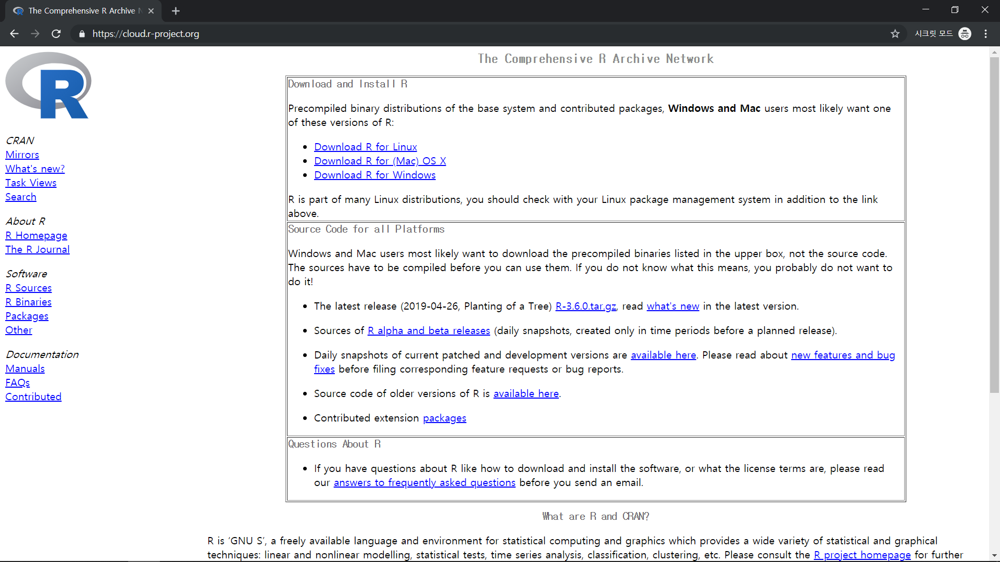
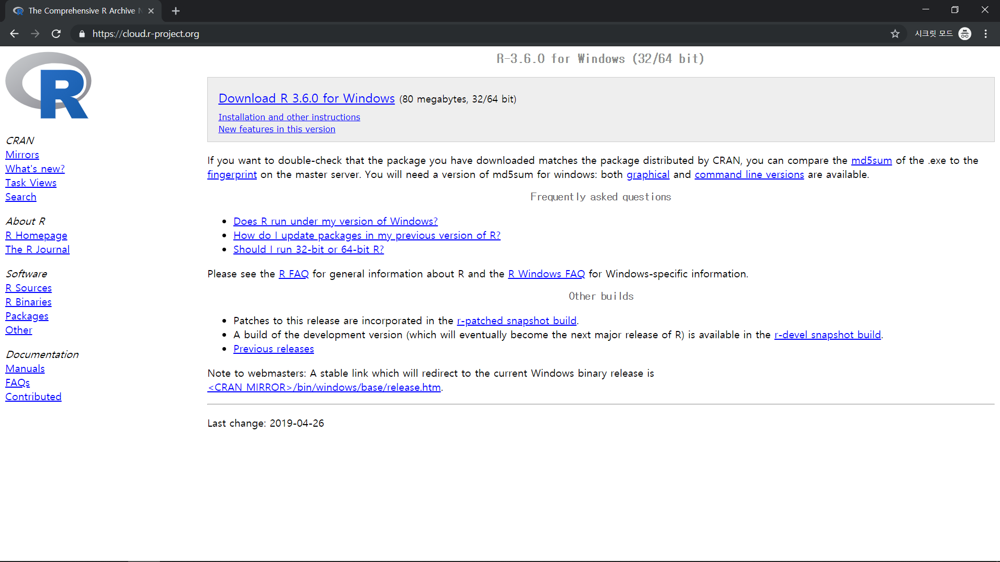
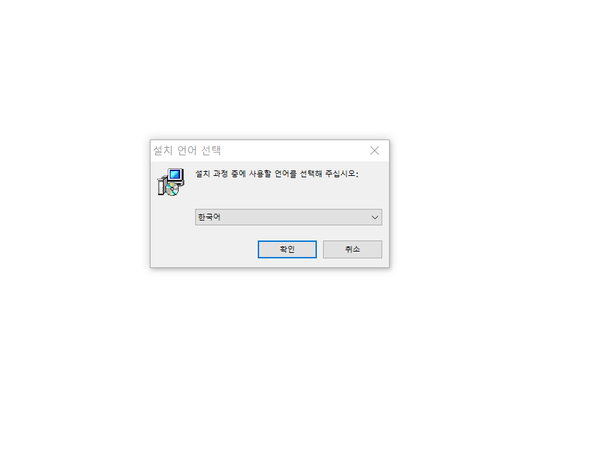
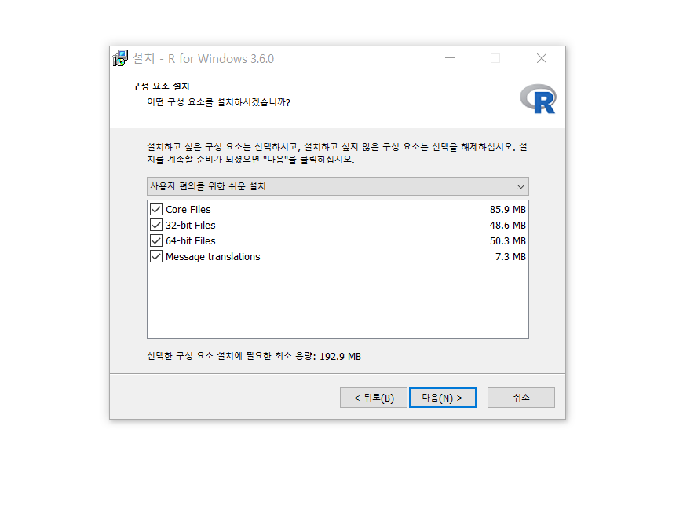
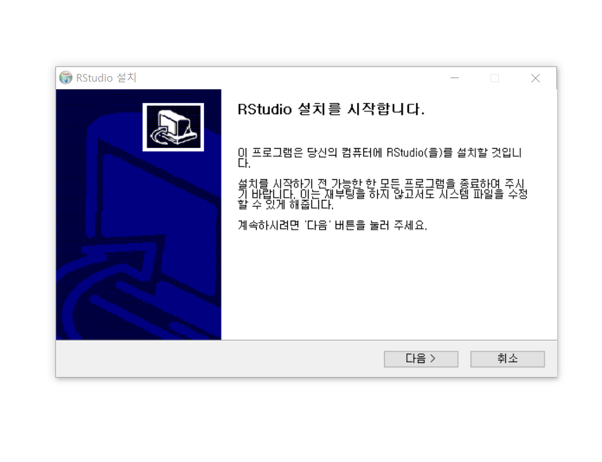
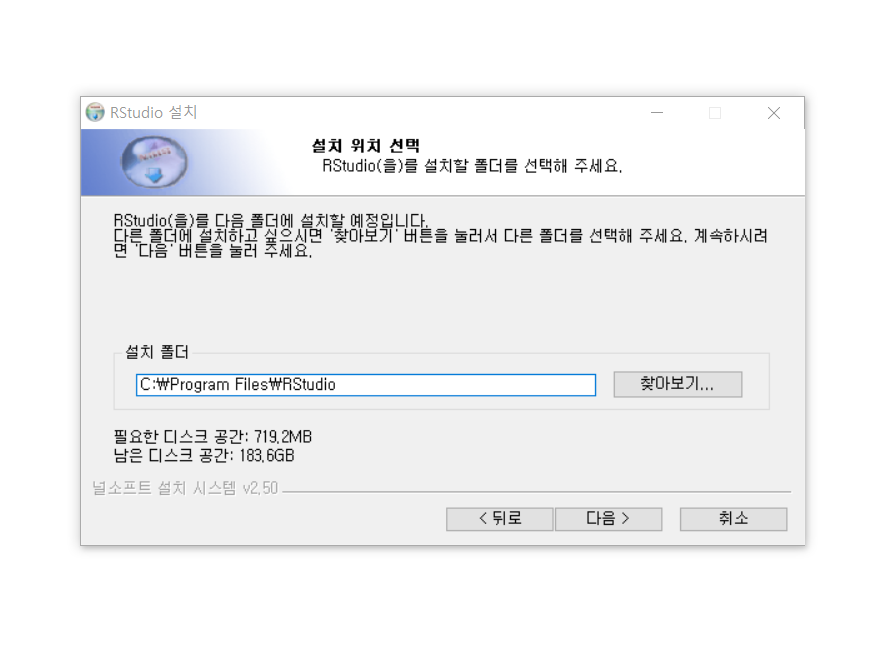
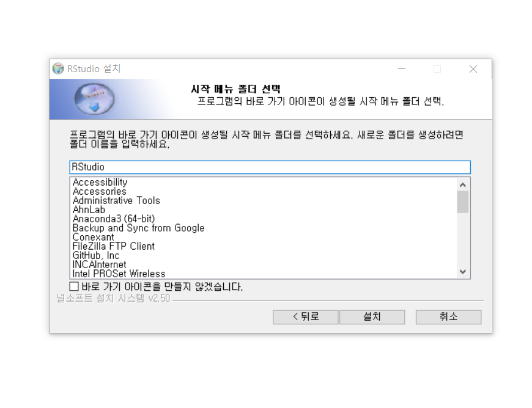
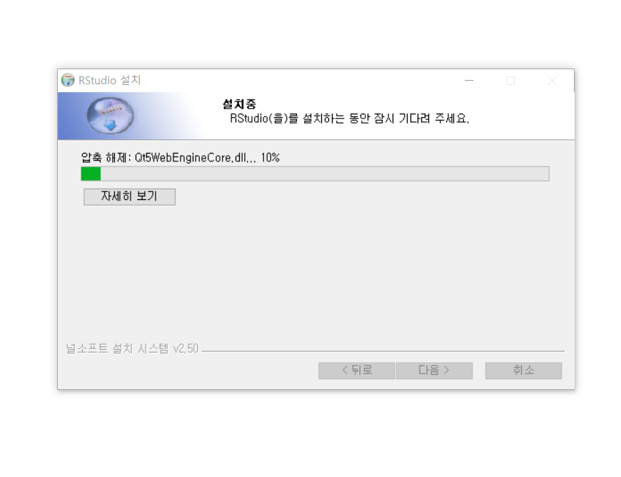
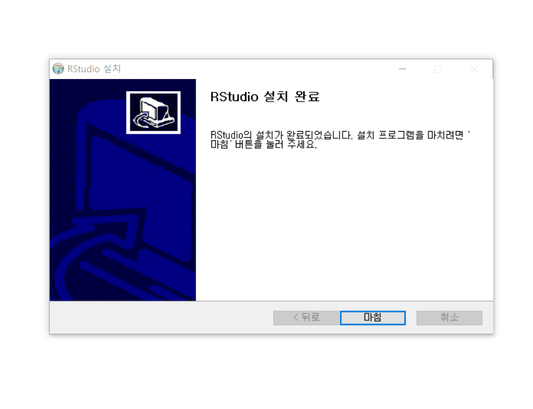

# R 및 RStudio 설치 #

작성 날짜 : 2019. 05. 04.

## R ##

R 홈페이지(<https://www.r-project.org>)를 통해서 설치파일을 받습니다.
Getting Started에서 파란색으로 표시된 `download R`을 클릭하면
R을 받을 수 있는 많은 웹페이지 주소를 볼 수 있습니다.
어디든 상관없지만 우리는 그 중 가장 위에 있는 0-Cloud의 웹페이지에서 설치파일을 받겠습니다.
RStudio에서 지원하는 웹사이트라는 설명이 있어 왠지 믿음이 갑니다.

### R 설치파일 다운로드 ###

1. 다운로드 페이지(<https://cloud.r-project.org>)에 접속해 `Download R for Windows`를 클릭합니다.

  

2. R을 처음 설치하기 위해서 `install R for the first time` 클릭합니다.

  

3. `Download R 3.6.0 for Windows` 클릭해서 설치파일을 다운로드합니다.
    
  (파일명 : `R-3.6.0-win.exe`)

  

### R 설치 ###

기본값을 기준으로 설치합니다.

1. 설치파일(`R-3.6.0-win.exe`) 실행
2. 이 앱이 디바이스를 변경할 수 있도록 허용하시겠어요? : 예

3. 설치 언어 선택 : `한국어` : 예

  

4. 정보 (GNU GENERAL PUBLIC LICENSE) : 다음

  

5. 설치할 위치 선택 : `C:\Program Files\R\R-3.6.0` : 예

  

6. 구성 요소 설치 : `Core Files`, `32-bit Files`, `64-bit Files`, `Message translations` 
(모두 선택) : 다음

  

7. 스타트업 옵션 : `No` (기본값 사용) : 다음

  

8. 시작 메뉴 폴더 선택 : `R` : 다음

  

9. 추가 사항 적용 : 아이콘 생성(두 항목 선택 없음), 레지스트리 항목들(두 항목 선택) : 다음

  

10. 설치 중

  

11. R for Windows 3.6.0 설치 완료 : 완료

  

## RStudio ##

[RStudio 홈페이지](https://www.rstudio.com)에 방문해서 설치파일을 받도록 합니다.

### RStudio 설치파일 다운로드 ###

1. 오른쪽 상단의 `Download RStudio` 단추 클릭

  

2. RStudio Desktop FREE 아래 초록색 `DOWNLOAD` 단추 클릭 
    
  (화면이 아래로 스크롤 됩니다.)

  

3. Installers for Supported Platforms에서 가장 윗줄에 위치한 `RStudio 1.2.1335 - Windows 7+ (64-bit)`을 클릭하면 설치파일 다운로드가 시작됩니다.
    
  (파일명 : `RStudio-1.2.1335.exe`)

  
  
### RStudio 설치 ###

기본값을 기준으로 설치합니다.

1. 설치파일(`RStudio-1.2.1335.exe`) 실행
2. 이 앱이 디바이스를 변경할 수 있도록 허용하시겠어요? : 예

3. RStudio 설치를 시작합니다. : 다음

  

4. 설치 위치 선택 : `C:\Program Files\RStudio` : 예

  

5. 시작 메뉴 폴더 선택 : `RStudio` : 설치

  

6. 설치중

  

7. RStudio 설치 완료 : 마침

  

